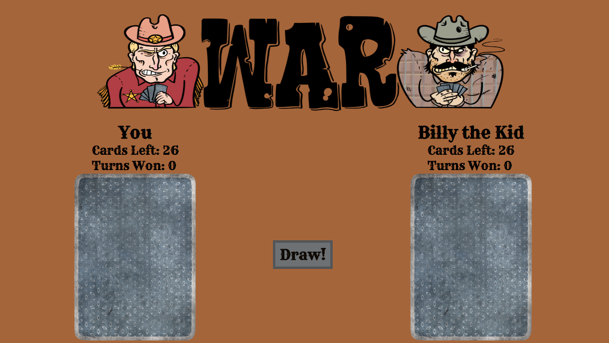
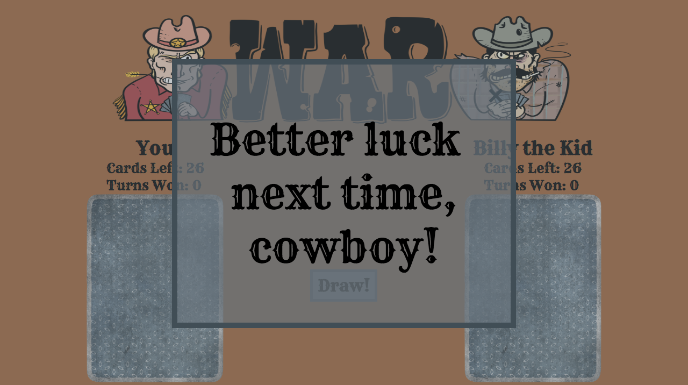

# War

#### _[You can access the game here](https://Bitajune.github.io/War)_

## Game Walkthrough

### Deal

##### _The deck is divided evenly, with each player receives 26 cards. The cards are dealt one at a time, face down._

### Game Play

##### _The top card of each player's deck is flipped over and compared. The player with the highest card wins both cards. The game ends when someone has taken all 52 cards._

### War!

##### _If both flipped cards have the same value, place three cards face down and flip the fourth card. Winner takes all cards._

